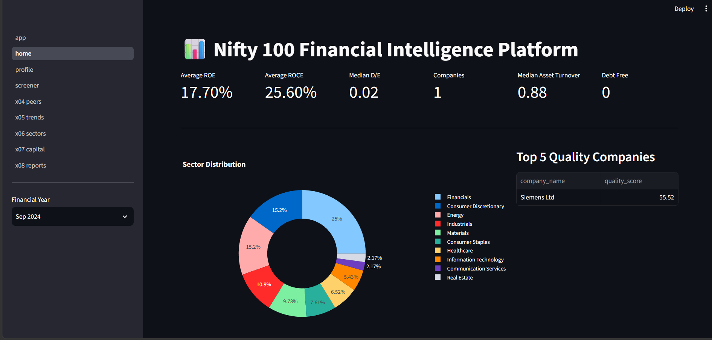
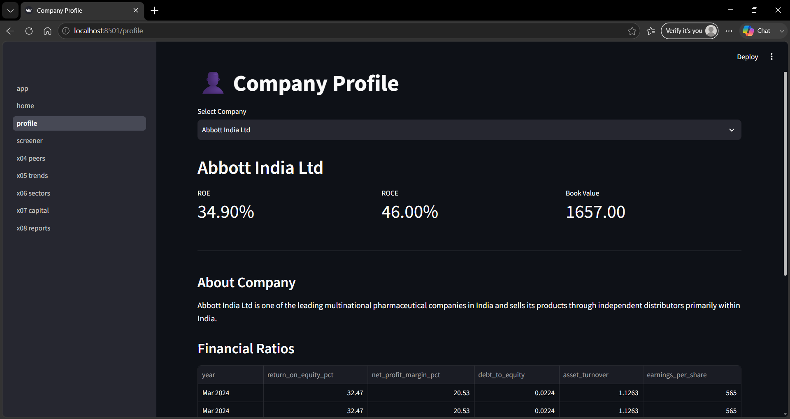
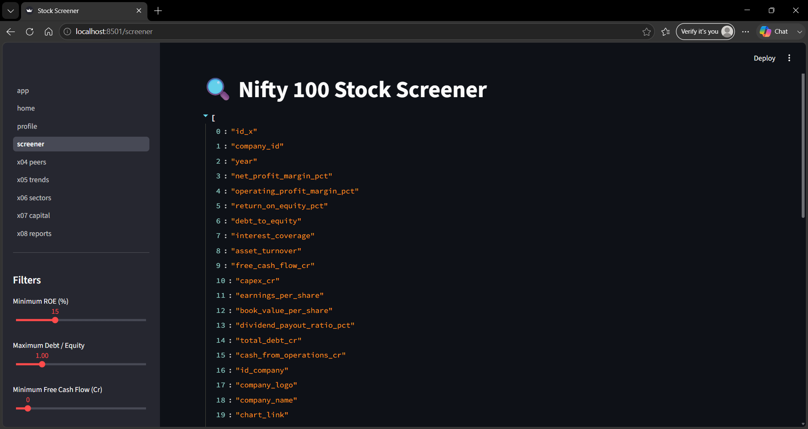
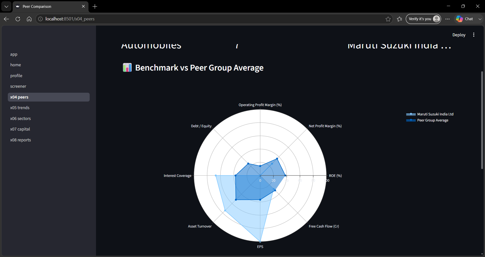
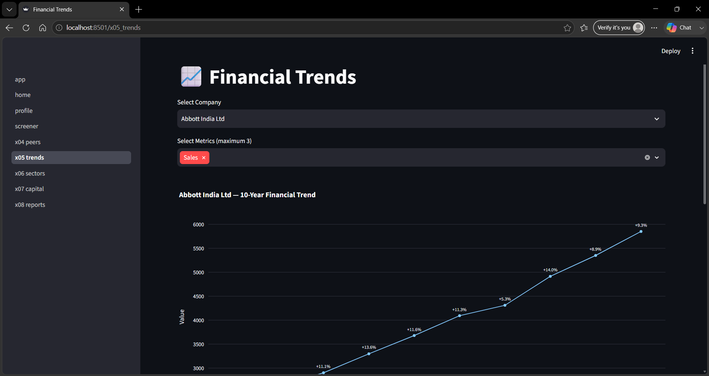
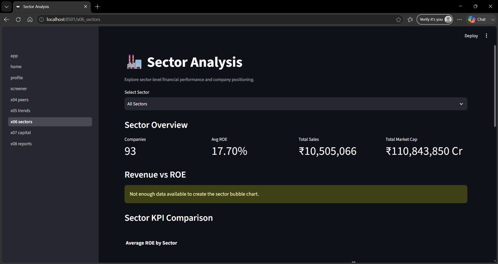
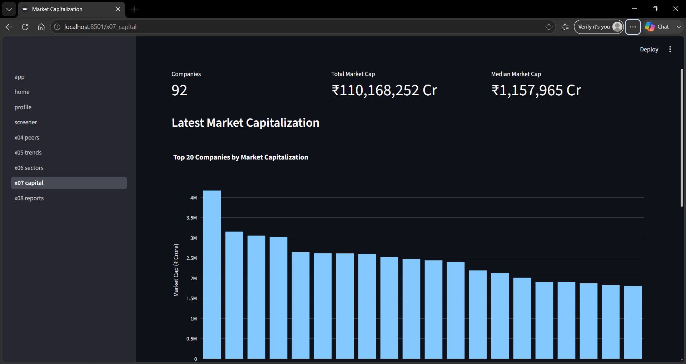
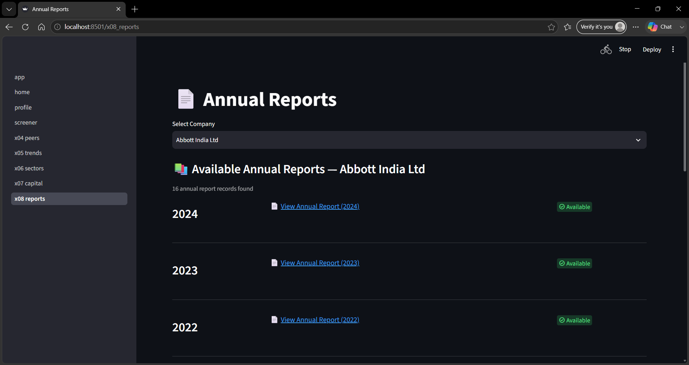

# Nifty 100 Financial Intelligence Platform

## How to Run

1. Create/activate virtual environment
2. Install dependencies
3. Run the dashboard:

streamlit run src/dashboard/app.py

## Dashboard Screens

### 1. Home
Overview of the Nifty 100 financial intelligence dashboard.

### 2. Company Profile
Displays detailed financial information and key metrics for a selected company.

### 3. Screener
Allows filtering and comparison of companies using financial metrics.

### 4. Peer Analysis
Compares companies with their relevant peer groups.

### 5. Financial Trends
Visualizes historical financial metrics and trends.

### 6. Sector Analysis
Provides sector-level financial and performance comparisons.

### 7. Market Capitalization
Shows latest market capitalization across Nifty 100 companies.

### 8. Company Reports
Displays growth analysis, pros and cons, and company-level reports.

## Key Outputs

- output/valuation_summary.xlsx
- output/valuation_flags.csv

## Valuation Module

The valuation module calculates:
- P/E
- P/B
- EV/EBITDA
- FCF Yield
- 5-year medians
- Sector medians
- Valuation flags

Flags:
- Discount
- Neutral
- Caution